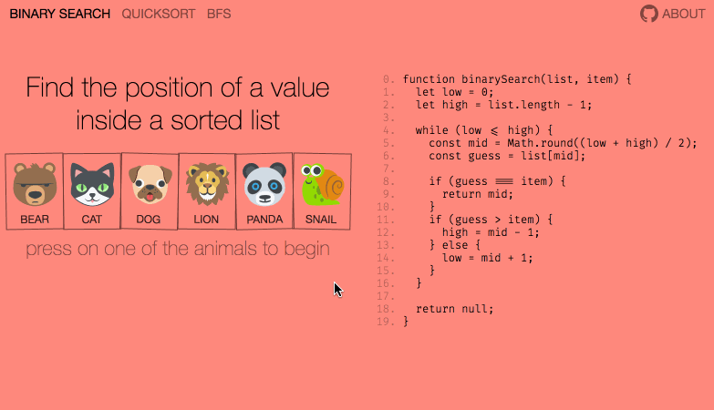

# Illustrated Algorithms
Algorithm → AST → CSS (3 x JavaScript)

[](https://illustrated-algorithms.now.sh/)

Inspired by [Grokking Algorithms](https://www.manning.com/books/grokking-algorithms) and [python-execution-trace](https://github.com/mihneadb/python-execution-trace), this project aims to reveal the mechanics behind algorithms via interactive visualizations of their execution.

Visual representations of variables and operations augment the control flow, alongside actual source code. You can fast forward and rewind the execution to closely observe how an algorithm works.

## Disclaimer ✌️

Edge cases and optimizations are beyond the scope of this project. The featured implementations are chosen for their simplicity and do not promise to work for data sets different from the illustrated ones. Please rely on other resources for learning algorithms in depth, from Wikipedia to other [visualization](https://visualgo.net/) [projects](https://www.youtube.com/watch?v=ywWBy6J5gz8). Also see community-driven [Footnotes](#footnotes). Thanks.

## Principles

- The same code that is displayed next to the illustration is also decorated using [babel-plugin-trace-execution](https://github.com/skidding/babel-plugin-trace-execution) and executed to record the context at every step. Literally the same source file.
- Going back and forth between function execution (and call stack when algorithm uses recursion) is effortless. So is pausing and resuming.
- Visualizations are easy to follow, fun to play with and simple enough to fit inside the screen of any modern phone.

## Work in progress

- Follow [@skidding](https://twitter.com/skidding) for updates
- Check out gifs attached to [Releases](https://github.com/skidding/illustrated-algorithms/releases) to see project evolution
- See [How to contribute](#how-to-contribute) below

## Dynamic styles

This project uses [styled-jsx](https://github.com/zeit/styled-jsx), but takes the idea of *CSS-in-JS* even further. Sizing, positioning and transition offsets are computed by JS, all before elements hit the DOM. This provides complete control over layout (e.g. font scaling relative to container width, rounded to a multiplier of 2) and animation (e.g. pausing in the middle of a transition and rewinding). It's a wild concept that hopefully gets mainstream someday.

## How to contribute

Consider the following actions if you want to advance this project:

- Find and/or fix bugs
- Add tests to [babel-plugin-trace-execution](https://github.com/skidding/babel-plugin-trace-execution)
- Improve rendering perf (already decent, but not ideal due to [how styles are applied](#dynamic-styles))
- Propose algorithms to add (that can fit in a func <=25 lines of ES6)
- Create elegant illustrations (sketches/wireframes do) – **Hello graphic designers and people who draw!**

Before submitting a PR, make sure to:
- Briefly describe the value of your contribution
- Stay in line with the project's mission (i.e. to make algorithms easy, see above sections)
- Test code before committing it via `npm run test`
- Thoroughly test the visual experience you're creating (e.g. algorithms must fit nicely on the screen)

## Development

```bash
npm i
# Start Next.js server (localhost:3000)
npm run dev
# Run tests
npm test
# Start React Cosmos playground (localhost:8989)
npm run cosmos
```

## Footnotes

While this project doesn't focus on algorithm implementation specifics, here's a list of valuable insights brought up by the community which serves to complement the visuals.

#### Binary Search

- [#21](https://github.com/skidding/illustrated-algorithms/issues/21) Calculating `mid` can be improved to avoid overflow when list is sufficiently large enough ([@mhaji](https://github.com/mhaji))

#### Quicksort

- [#19](https://github.com/skidding/illustrated-algorithms/issues/19) Extending implementation to support duplicates ([@ACollectionOfAtoms](https://github.com/ACollectionOfAtoms))

---

Please note that this project is released with a [Contributor Code of Conduct.](CODE_OF_CONDUCT.md) By participating in this project you agree to abide by its terms.
